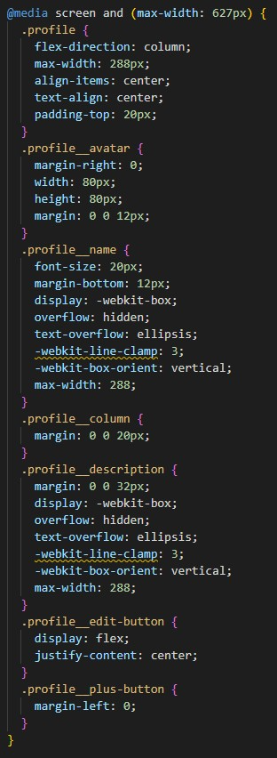

#Sprint Week-3 Project: Spots

An interactive image posting and sharing website.

##Description

This is an image sharing based webpage similar to a social media platform. Display has been optimized to function on different screens. A simple and sleek display for sharing important content.

##Tech Stack

-HTML
-CSS
-Responsive Design: add button, like button, & edit button.
-design based on: [Link to the project on Figma](https://www.figma.com/file/BBNm2bC3lj8QQMHlnqRsga/Sprint-3-Project-%E2%80%94-Spots?type=design&node-id=2%3A60&mode=design&t=afgNFybdorZO6cQo-1)

-display size based CSS features: @media in CSS

##Pitch Video (recorded on Loom): (https://www.loom.com/share/8fb0f36aba4f48d9a2e1593c81ab1d18)

##Deployment
-This webpage is deployed on GIT Hub [Link to the project on Github] (https://epkolodziejiii.github.io/se_project_spots/)
